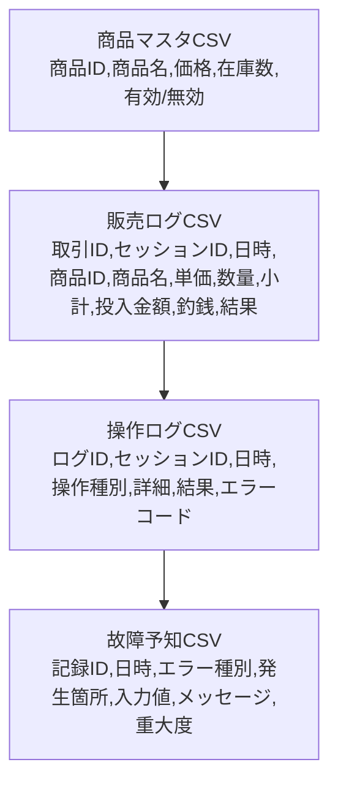
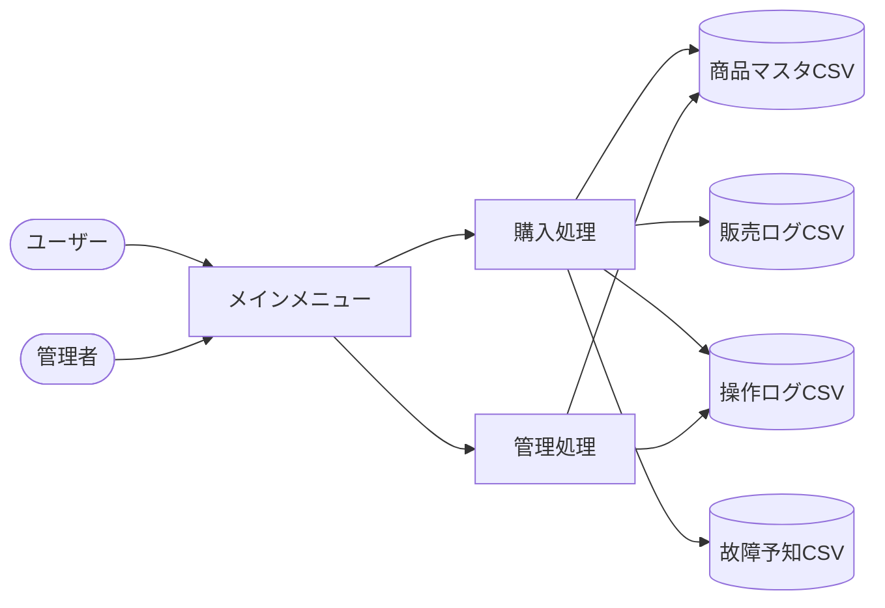

# 改訂版 要件定義書（自動販売機システム）

---

## 1. システム概要

本システムは、複数ユーザー対応の自動販売機を模した業務アプリケーションです。商品管理・購入・ログ保存・エラー耐性・拡張性・保守性・セキュリティを重視し、現場運用や将来の拡張にも対応できる設計を目指します。

---

## 2. 画面・操作イメージ

### 2.1 主要画面一覧
| 画面             | 主な機能ID | 機能概要                       |
|:-----------------|:----------|:-------------------------------|
| メインメニュー   | F01,F13   | 商品一覧表示、複数客対応        |
| 購入画面         | F07,F08   | 商品選択、数量入力              |
| 合計金額表示     | F09       | 合計金額表示                    |
| 現金投入         | F10       | 現金投入受付                    |
| 釣銭計算         | F11       | 釣銭計算・返却                  |
| 完了画面         | F12       | 購入確定                        |
| 管理メニュー     | F02,F03,F04,F06 | 商品登録・編集・削除・入れ替え |
| 完了メッセージ   | F14       | ログ保存                        |

### 2.2 画面遷移図

```mermaid
flowchart TD
  M[メインメニュー]
  M -->|[1] 購入| P1[購入画面: 商品一覧]
  P1 -->|商品選択| P2[数量入力]
  P2 -->|決定| P3[合計金額表示]
  P3 -->|現金投入| P4[投入金額確認]
  P4 -->|不足| P3
  P4 -->|充足| P5[釣銭計算]
  P5 -->|[確定]| P6[完了画面]
  P6 -->|[メニューへ戻る]| M
  M -->|[2] 管理| A0[管理メニュー]
  A0 -->|[1] 商品登録| A1[商品登録画面]
  A0 -->|[2] 商品編集| A2[商品編集画面]
  A0 -->|[3] 商品削除| A3[商品削除画面]
  A0 -->|[4] 商品入れ替え| A4[商品入れ替え画面]
  A1 -->|保存| A5[完了メッセージ]
  A2 -->|保存| A5
  A3 -->|実行| A5
  A4 -->|実行| A5
  A5 -->|[管理メニューへ戻る]| A0
  A0 -->|[0] メインへ戻る| M
  M -->|[0] 終了| E[終了]
```

---

## 3. 機能要件

- 各機能に対し、正常系・異常系・境界値の動作を明記
- 例外発生時のユーザー誘導（エラーメッセージ、再入力、メニュー復帰）を明示
- 拡張性（新機能追加やUI変更）を考慮した設計

| 機能ID | 機能名             | 概要・詳細                                                    |
|:------:|:------------------|:-------------------------------------------------------------|
| F01    | 商品一覧表示         | 商品名・価格・在庫数を表形式で表示。0在庫商品はグレーアウト。 |
| F02    | 商品登録             | 商品ID自動採番。上限超過時はエラー表示。                     |
| F03    | 商品情報編集         | 商品名・価格・在庫数を編集。編集後は即時反映。               |
| F04    | 商品削除             | 削除前に確認ダイアログ表示。                                 |
| F05    | 在庫数自動更新       | 購入確定時のみ減算。                                         |
| F06    | 商品入れ替え         | 商品情報を新商品で上書き。                                   |
| F07    | 商品選択             | 商品IDまたはカーソル選択対応。                               |
| F08    | 数量入力             | 1～在庫数の範囲のみ許容。不正時は再入力。                   |
| F09    | 合計金額表示         | 税込金額・小計・合計を明示。                                 |
| F10    | 現金投入受付         | 数値以外はエラー。投入金額不足時は再投入を促す。             |
| F11    | 釣銭計算・返却       | 釣銭が発生しない場合も明示。                                 |
| F12    | 購入確定             | 在庫・売上・ログを同時更新。                                 |
| F13    | 複数客対応           | セッションIDで利用者を区別。排他制御あり。                   |
| F14    | ログ保存             | 全操作・エラー・販売履歴をCSV保存。                          |

---

## 4. 非機能要件

| 区分 | 要件 | 補足・測定方法 |
| :--- | :--- | :--- |
| 可用性 | 異常発生時もメニュー復帰 | 例外発生時のログ記録・自動復帰を実装。 |
| 性能 | 通常操作は1秒以内 | テスト時は10ユーザー同時操作で計測。 |
| 保守性 | 定数・設定はconfigで集中管理 | 設定ファイルで一元管理。 |
| ログ品質 | 全ログに日時・操作種別・結果・セッションID | ログCSVのサンプルを添付。 |
| 操作性 | 3ステップ以内で購入完了 | 画面遷移図で検証。 |
| セキュリティ | CSVファイルの排他制御・改ざん検知 | ファイルロック・ハッシュ値記録。 |
| 拡張性 | 新機能追加時も既存機能に影響なし | モジュール分割設計。 |

---

## 5. 制約条件・前提

| 項目 | 内容 | 備考 |
| :--- | :--- | :--- |
| 商品種類数 | 最大50種類 | 上限超過時は登録不可 |
| 在庫数 | 0～50 | 範囲外はエラー |
| 入力方式 | キーボード数値入力 | UI拡張余地あり |
| データ保存 | CSV（UTF-8） | ファイルロック必須 |
| 同時利用 | セッション単位で排他 | 競合時は待機またはエラー |

---

## 6. 受け入れ基準（テスト観点例）

| ID | 受け入れ基準 | テスト観点 |
| :--: | :--- | :--- |
| A01 | 商品登録時、51件目は拒否 | 上限境界値テスト |
| A02 | 在庫超過の数量入力は不可 | 境界値・異常系テスト |
| A03 | 購入確定時に合計金額・釣銭が正しい | 計算ロジック・UI表示 |
| A04 | 取引ごとに販売・操作ログが追記 | ログ内容・CSV出力 |
| A05 | 不正入力時もプログラム停止せず復帰 | 例外処理・エラーメッセージ |
| A06 | エラーログに種別・時刻を記録 | ログ品質・障害対応 |

---

## 7. データ設計・ファイル構造

### 7.1 データ構造
| データ名 | 機能要件対応 | 内容・説明 |
| :--- | :--- | :--- |
| 商品マスタ | F01,F02,F03,F04,F06 | 商品ID、商品名、価格、在庫数、有効/無効（最大50件） |
| 取引情報 | F05,F07,F08,F09,F10,F11,F12 | 取引ID、セッションID、商品ID、数量、合計金額、投入金額、釣銭、日時 |
| 操作ログ | F14 | ログID、セッションID、日時、操作種別、詳細、結果、エラーコード |
| 故障予知データ | F14 | 記録ID、日時、エラー種別、発生箇所、入力値、メッセージ、重大度 |
| セッション情報 | F13 | 複数利用者を区別するための利用単位情報 |

### 7.2 CSVファイル構造図


---

## 8. データフロー図



---

## 9. 補足・運用・保守・拡張性

- ファイル破損時の復旧手順、バックアップ運用を明記
- セキュリティ（ファイル改ざん検知、アクセス権管理）
- モジュール分割・インターフェース設計で将来の機能追加に備える
- UI拡張（タッチパネル等）や多言語対応の余地を設計段階で考慮

---

※本ドキュメントは現場開発・運用・保守・拡張を見据え、具体性・網羅性・説明力を重視して作成しています。
