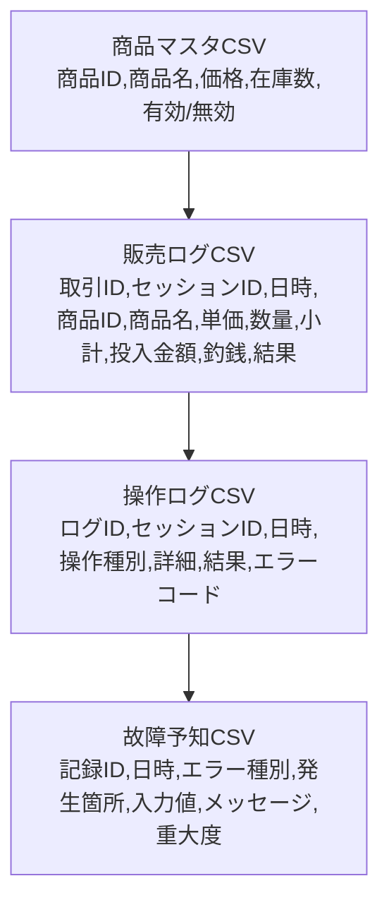
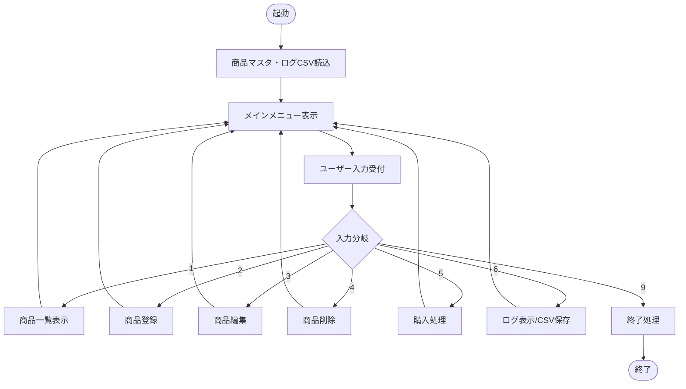
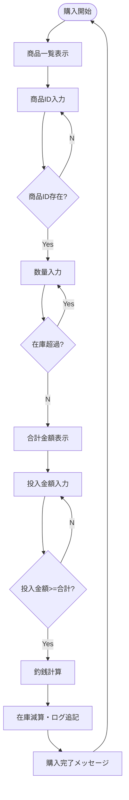

# 🛠️ 改訂版 設計ワークシート（自動販売機システム）

---

## 1. プロジェクト情報

| 項目 | 記入欄 |
| :--- | :--- |
| **チーム名** | （記入必須） |
| **選択テーマ（A〜C）** | （記入必須） |
| **アプリ名** | 自動販売機システム |

---

## 2. 要求仕様書（顧客ヒアリング結果）

### 2.1 顧客の要望（ヒアリングメモ）
- 商品一覧を確認できること（UIは表形式、0在庫はグレーアウト）
- 商品の登録・編集・削除ができること（確認ダイアログ必須）
- 購入時に在庫が自動で減算されること（境界値・異常系も考慮）
- 金額投入と釣銭計算ができること（釣銭なしも明示）
- 失敗入力でもプログラムが停止せず再入力を促すこと（例外時の復帰動線）
- 取引や操作のログをCSV形式で記録すること（ファイル破損時の復旧手順も明記）
- セキュリティ（CSV改ざん検知、アクセス権管理）
- 拡張性（新機能追加やUI変更への柔軟性）

### 2.2 機能要件

| 機能ID | 機能名             | 概要・詳細                                                    |
|:------:|:------------------|:-------------------------------------------------------------|
| F01    | 商品一覧表示         | 商品名・価格・在庫数を表形式で表示。0在庫商品はグレーアウト。 |
| F02    | 商品登録             | 商品ID自動採番。上限超過時はエラー表示。                     |
| F03    | 商品情報編集         | 商品名・価格・在庫数を編集。編集後は即時反映。               |
| F04    | 商品削除             | 削除前に確認ダイアログ表示。                                 |
| F05    | 在庫数自動更新       | 購入確定時のみ減算。                                         |
| F06    | 商品入れ替え         | 商品情報を新商品で上書き。                                   |
| F07    | 商品選択             | 商品IDまたはカーソル選択対応。                               |
| F08    | 数量入力             | 1～在庫数の範囲のみ許容。不正時は再入力。                   |
| F09    | 合計金額表示         | 税込金額・小計・合計を明示。                                 |
| F10    | 現金投入受付         | 数値以外はエラー。投入金額不足時は再投入を促す。             |
| F11    | 釣銭計算・返却       | 釣銭が発生しない場合も明示。                                 |
| F12    | 購入確定             | 在庫・売上・ログを同時更新。                                 |
| F13    | 複数客対応           | セッションIDで利用者を区別。排他制御あり。                   |
| F14    | ログ保存             | 全操作・エラー・販売履歴をCSV保存。                          |

【補足】
- F01: 在庫0の商品は選択不可・グレー表示。表の並び順は商品ID昇順。
- F02: 商品IDは重複不可。登録時に必ず件数チェック。
- F03: 編集後は即時保存。価格・在庫は負数不可。
- F04: 削除は「本当に削除しますか？」の確認必須。
- F05: 在庫減算時、0未満にならないよう制御。
- F07: 商品ID直接入力とカーソル選択の両方に対応。
- F08: 在庫超過や0以下は再入力ループ。
- F09: 合計金額は税込・小計・合計を明示し、端数処理も考慮。
- F10: 投入金額が不足の場合は差額を表示。
- F13: セッションIDは同時利用者識別用。排他制御で競合防止。

---

## 3. 基本設計

### 3.1 画面遷移図（Mermaid）

```mermaid
flowchart TD
  M[メインメニュー]
  M -->|[1] 購入| P1[購入画面: 商品一覧]
  P1 -->|商品選択| P2[数量入力]
  P2 -->|決定| P3[合計金額表示]
  P3 -->|現金投入| P4[投入金額確認]
  P4 -->|不足| P3
  P4 -->|充足| P5[釣銭計算]
  P5 -->|[確定]| P6[完了画面]
  P6 -->|[メニューへ戻る]| M
  M -->|[2] 管理| A0[管理メニュー]
  A0 -->|[1] 商品登録| A1[商品登録画面]
  A0 -->|[2] 商品編集| A2[商品編集画面]
  A0 -->|[3] 商品削除| A3[商品削除画面]
  A0 -->|[4] 商品入れ替え| A4[商品入れ替え画面]
  A1 -->|保存| A5[完了メッセージ]
  A2 -->|保存| A5
  A3 -->|実行| A5
  A4 -->|実行| A5
  A5 -->|[管理メニューへ戻る]| A0
  A0 -->|[0] メインへ戻る| M
  M -->|[0] 終了| E[終了]
```

【補足】
- 各矢印はユーザー操作やシステム自動遷移を表します。
- [充足]は投入金額が十分な場合、[不足]は不足時の再投入ループ。
- 管理メニューから各管理機能へ分岐し、完了後は必ずメニューに戻る設計です。

### 3.2 画面・機能対応表

| 画面             | 主な機能ID | 機能概要                       |
|:-----------------|:----------|:-------------------------------|
| メインメニュー   | F01,F13   | 商品一覧表示、複数客対応        |
| 購入画面         | F07,F08   | 商品選択、数量入力              |
| 合計金額表示     | F09       | 合計金額表示                    |
| 現金投入         | F10       | 現金投入受付                    |
| 釣銭計算         | F11       | 釣銭計算・返却                  |
| 完了画面         | F12       | 購入確定                        |
| 管理メニュー     | F02,F03,F04,F06 | 商品登録・編集・削除・入れ替え |
| 完了メッセージ   | F14       | ログ保存                        |

【補足】
- 各画面は1つ以上の機能IDに対応。管理メニューは複数の管理系機能を集約。
- 完了メッセージ画面は操作ログや販売ログの保存完了を明示します。

---

## 4. 非機能要件

| 区分 | 要件 | 測定・補足 |
| :--- | :--- | :--- |
| 可用性 | 異常発生時もメニュー復帰 | 例外発生時のログ記録・自動復帰を実装 |
| 性能 | 通常操作は1秒以内 | テスト時は10ユーザー同時操作で計測 |
| 保守性 | 定数・設定はconfigで集中管理 | 設定ファイルで一元管理 |
| ログ品質 | 全ログに日時・操作種別・結果・セッションID | ログCSVのサンプルを添付 |
| 操作性 | 3ステップ以内で購入完了 | 画面遷移図で検証 |
| セキュリティ | CSVファイルの排他制御・改ざん検知 | ファイルロック・ハッシュ値記録 |
| 拡張性 | 新機能追加時も既存機能に影響なし | モジュール分割設計 |

---

## 5. 制約条件・前提

| 項目 | 内容 | 備考 |
| :--- | :--- | :--- |
| 商品種類数 | 最大50種類 | 上限超過時は登録不可 |
| 在庫数 | 0～50 | 範囲外はエラー |
| 入力方式 | キーボード数値入力 | UI拡張余地あり |
| データ保存 | CSV（UTF-8） | ファイルロック必須 |
| 同時利用 | セッション単位で排他 | 競合時は待機またはエラー |

---

## 5-2. 入力値・データ仕様の明文化

| 項目 | 仕様・補足 |
| :--- | :--- |
| 商品名 | 最大20文字、全角・半角可、記号（, " \n）は不可 |
| 価格 | 0～99999の整数、半角数字のみ |
| 在庫数 | 0～50の整数、半角数字のみ |
| 日時 | YYYY-MM-DD HH:MM:SS 形式、24時間制 |
| 商品ID | 1からの連番、重複不可、削除IDは再利用しない |
| セッションID | 英数字8桁ランダム、重複不可、有効期限は取引終了まで |
| ログID | 1からの連番、日付でリセットしない |
| ファイルパス | アプリ配下のdata/ディレクトリに限定 |

---

## 5-3. エラー時の動作・ユーザー体験

- 入力エラー時は「エラー内容＋再入力を促す」メッセージを画面下部に表示。
- 再入力は3回まで許容し、3回連続失敗時はメインメニューに自動復帰。
- 重大エラー（ファイル破損等）はエラーメッセージ表示後、ログ記録しメインメニューに戻る。
- エラー発生時は必ず操作ログ・故障予知ログに記録。
- エラー時の音や色分け（赤字等）でユーザーに明確に通知。

---

## 5-4. ファイル操作・排他制御・データ初期化

- CSVファイルは排他ロック（書き込み時のみ）を行い、競合時は1秒間隔で3回までリトライ。
- ファイル破損時は自動で.bakバックアップから復旧を試行し、失敗時は管理者通知。
- 初回起動時、商品マスタ・ログファイルが存在しない場合は自動生成。
- バージョンアップ時のデータ移行はマイグレーションスクリプトで対応。

---

## 5-5. セッション管理・多重利用

- セッションIDは取引開始時に発行し、終了時に破棄。
- 多重ログイン時は同一セッションIDを発行せず、同時利用は排他制御。
- セッション情報はメモリとCSV両方で管理。

---

## 5-6. UI/UX細部・操作性

- 画面遷移時は前画面の入力内容を保持（キャンセル時の復帰用）。
- 入力欄は自動フォーカス、Tabキーで移動可。
- ショートカットキー（例：Enter=決定、Esc=キャンセル）を明示。
- 画面下部に操作ガイド・エラーメッセージを常時表示。
- 戻る操作は常に1つ前の画面に遷移。

---

## 5-7. セキュリティ・ログ・保存場所

- CSVファイルはdata/配下に保存し、外部からの直接アクセスを禁止。
- ファイル・ディレクトリは実行ユーザーのみ書込可。
- ログ・CSVは改ざん検知用にハッシュ値を付与。
- ログの保持期間は1年、以降は自動アーカイブ。
- ログ監査証跡は管理者のみ閲覧可。

---

## 5-8. 多言語・拡張対応

- メッセージ・ラベルは日本語/英語切替に対応（configで指定）。
- UI部品は多言語化・新機能追加時に再利用可能な設計。
- 画面レイアウトはレスポンシブ対応を想定。

---

## 5-9. データ移行・初期化

- 商品マスタ・ログの初期データはCSVテンプレートを用意。
- データ移行時は旧バージョンCSVを自動判別し、必要に応じて変換。

---

---

## 6. 受け入れ基準（テスト観点例）

| ID | 受け入れ基準 | テスト観点 |
| :--: | :--- | :--- |
| A01 | 商品登録時、51件目は拒否 | 上限境界値テスト |
| A02 | 在庫超過の数量入力は不可 | 境界値・異常系テスト |
| A03 | 購入確定時に合計金額・釣銭が正しい | 計算ロジック・UI表示 |
| A04 | 取引ごとに販売・操作ログが追記 | ログ内容・CSV出力 |
| A05 | 不正入力時もプログラム停止せず復帰 | 例外処理・エラーメッセージ |
| A06 | エラーログに種別・時刻を記録 | ログ品質・障害対応 |
| A07 | CSVファイル破損時の復旧が可能 | バックアップ・リカバリ手順 |

---

## 7. データ設計・ファイル構造

### 7.1 データ構造
| データ名 | 機能要件対応 | 内容・説明 |
| :--- | :--- | :--- |
| 商品マスタ | F01,F02,F03,F04,F06 | 商品ID、商品名、価格、在庫数、有効/無効（最大50件） |
| 取引情報 | F05,F07,F08,F09,F10,F11,F12 | 取引ID、セッションID、商品ID、数量、合計金額、投入金額、釣銭、日時 |
| 操作ログ | F14 | ログID、セッションID、日時、操作種別、詳細、結果、エラーコード |
| 故障予知データ | F14 | 記録ID、日時、エラー種別、発生箇所、入力値、メッセージ、重大度 |
| セッション情報 | F13 | 複数利用者を区別するための利用単位情報 |

【補足】
- 商品マスタの「有効/無効」は販売停止商品管理用。
- セッションIDは同時利用者識別やログ紐付けに利用。
- 故障予知データは異常発生時の詳細分析用。

### 7.2 CSVファイル構造図


【補足】
- 各CSVは独立管理だが、IDや日時で相互参照可能。
- 商品マスタ→販売ログ→操作ログ→故障予知の順で履歴が深まる。
- 販売ログには商品名や単価も記録し、後から商品マスタが変わっても履歴が残る。

---

## 8. 詳細設計（アルゴリズム・フローチャート）

### 8.1 メインループ



【補足】
- 各分岐はユーザー入力値（1～6,9）で決定。
- 各機能終了後は必ずメインメニューに戻る。
- 終了時は全データ保存・リソース解放を実施。

### 8.2 個別機能のアルゴリズム（例：購入処理）



【補足】
- No分岐は再入力ループ。Yes分岐で次工程へ進む。
- 在庫減算時は0未満にならないよう制御。
- ログ追記は販売ログ・操作ログ両方に記録。
- 購入完了後は再度購入開始に戻る設計（連続購入対応）。

---

## 9. エラーハンドリング・運用設計

| 異常系シナリオ | 対処方針 |
| :--- | :--- |
| 数字以外の文字が入力された場合 | 入力エラーとしてメッセージを表示し、再入力を促す |
| 存在しない商品IDが入力された場合 | エラーメッセージを表示し、商品ID入力に戻す |
| 在庫を超える数量が入力された場合 | 再入力を促し、指定数量が在庫以下になるまで繰り返す |
| 投入金額が合計より少ない場合 | 不足分を表示し、再投入を促す |
| CSVファイルが書き込み不可の場合 | エラーメッセージを表示してメニューへ復帰し、ログ保存は次回起動時に再試行可能とする |
| CSVファイル破損・改ざん検知 | バックアップからの復旧手順を明記し、改ざん時は警告表示 |
| 多重起動・同時書き込み | ファイルロックで排他制御、競合時はエラー表示 |

---

## 10. 備考・拡張・保守観点

- 商品数上限や在庫数などの定数はconfigで一元管理
- CSVはUTF-8、改行コードはOS依存しない形式
- 入力検証は共通関数化し、全画面で再利用
- 操作ログと故障予知ログを分離し、通常操作と異常系を明確化
- UI拡張（タッチパネル、多言語対応）や新機能追加を見据えたモジュール設計
- ファイル破損時のバックアップ・リカバリ手順を運用マニュアルに明記
- セキュリティ（アクセス権、改ざん検知、ログ監査）も設計段階で考慮

---

※本ドキュメントは現場開発・運用・保守・拡張を見据え、具体性・網羅性・説明力を重視して作成しています。
